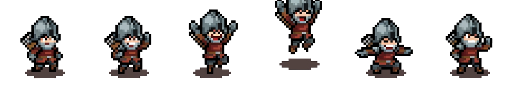

# 🏰 Playable CV — Dungeon Physics Edition

<p align="center">
  
</p>

<p align="center">
  <b>Interactive 2D Physics Playable Ad Minigame</b><br>
  A creative interactive CV built with TypeScript, Matter.js 2D Physics Engine & Web Audio API Synthesizer.
</p>

<p align="center">
  
  
  
  
  
</p>

---

## 🎮 Concept & Core Gameplay

Thay vì gửi CV file PDF thông thường, **Playable CV** biến trải nghiệm xem hồ sơ xin việc thành một **Minigame Vật lý 2D Hầm ngục**:

* **Cửa sập Hầm ngục (Trapdoor):** Đang khóa giữ 50 tiền vàng phía trên. Dưới cửa sập gắn sẵn Móc J (J-Hook).
* **Hiệp sĩ Chibi:** Đứng bên dưới giơ tay chờ nhận Offer Letter / Vàng.
* **Hòm thông tin CV:** Các khối rương gỗ chứa thông tin **Lã Việt Cường (20kg)**, **Học vấn (15kg)** và **Kỹ năng (15kg)**.
* **Mục tiêu:** Drag & drop các Hòm CV móc nối tiếp (Chain Hooking) vào Cửa sập để đạt tổng trọng lượng **50kg**, mở khóa kho báu và nút **Download CV (PDF)**.

---

## ✨ Features & Technical Highlights

### ⚖️ 2D Physics & Constraint Simulation (Matter.js)
* **Revolute Joints:** Khớp xoay cơ học cho 2 cánh cửa sập gỗ.
* **Chain Hooking & Auto-Snap:** Thuật toán hút tự động trong bán kính 25px (`SNAP_RADIUS`), kết nối móc O-ring và J-hook liên hoàn.
* **Real-time Mass Detection:** Theo dõi tổng trọng lượng tác động lên cửa sập theo thời gian thực.
* **Dynamic Z-Index DOM Sync:** Đồng bộ vị trí giữa Matter.js Rigid Bodies và DOM Elements với hệ thống Z-Index thông minh khi Drag & Drop.

### 🎬 Easter Egg — Ads Heavyweight (Quả Tạ Quảng Cáo)
* Nút **"Xem Quảng Cáo 🎬"** đếm ngược 5 giây mở khóa nút **"Bỏ qua ⏭"**.
* Thả trực tiếp **Quả Tạ 50kg Heavyweight** làm sụt sập ngay lập tức!

### 🔊 Web Audio API Synthesizer (0 KB Asset Overhead)
* Tự tổng hợp âm thanh bằng code Web Audio API, không cần tải bất kỳ file sound MP3 nào:
  * 🔔 **Clink-Ring!** (Móc treo thành công)
  * 🪵 **Thud!** (Hòm va chạm đất)
  * 🪙 **Coin Shower!** (Chuỗi 10 nốt đồng xu nảy dồn dập khi thắng)
  * 🖱️ **UI Pop!** (Âm thanh nút bấm retro)
* Nút Mute **(🔊 / 🔇)** ở góc trên bên phải.

---

## 🛠 Tech Stack

| Thành phần | Công nghệ sử dụng |
| :--- | :--- |
| **Language** | TypeScript (Strict type safety) |
| **Build Tool** | Vite (HMR fast dev server) |
| **Physics Engine** | Matter.js 2D Physics |
| **Audio** | Web Audio API Synthesizer |
| **Styling & UI** | Tailwind CSS + Custom Pixel Art CSS |

---

## 📁 Structure

```
MinigameCV/
├── public/                # Static assets (Sprites, Icons, Backgrounds)
├── src/
│   ├── audio/             # Web Audio API Synthesizer (SFX Engine)
│   ├── config/            # Game constants & Physics parameters
│   ├── engine/            # Matter.js physics engine, constraints & hook system
│   ├── entities/          # Block logic, Trapdoor joints & Gold coins
│   ├── ui/                # DOM sync & Z-index management
│   └── main.ts            # Main application entrypoint
├── GDD.md                 # Game Design Document (Chi tiết kỹ thuật)
└── index.html             # UI Layout & Canvas container
```

---

## 🚀 Quick Start (Local Development)

```bash
# 1. Clone repository
git clone https://github.com/AvieC/Minigame_CV.git
cd Minigame_CV

# 2. Install dependencies
npm install

# 3. Start development server
npm run dev
```

Mở browser tại `http://localhost:5173` để trải nghiệm game.

---

## 👨‍💻 Author

* **Lã Việt Cường** (Developer | CNTT UET)
* **GDD Details:** Tham khảo thêm file [GDD.md](GDD.md) để xem tài liệu thiết kế chi tiết.
